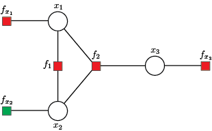

# [Output Data](@id output)

The main inference results are kept in the composite type `GraphicalModel` in the subtype `Inference` with fields:
- `FactorVariable`,
- `meanFactorVariable`,
- `varianceFactorVariable`,
- `VariableFactor`
- `meanVariableFactor`,
- `varianceVariableFactor`,
- `mean`,
- `variance`.

The values of messages from factor nodes to variable nodes can be accessed using `meanFactorVariable` and `varianceFactorVariable` fields, while values of messages from variable nodes to factor nodes are stored in `meanVariableFactor` and `varianceVariableFactor` fields. These values correspond to edges defined by factor and variable nodes, with indexes preserved in `FactorVariable` and `VariableFactor` fields.

Fields `mean` and `variance` define state variable marginal distributions.

---

The `Inference` field contains the GBP algorithm results. To describe the outputs, we will use the example shown below.
```julia-repl
using GaussBP

#     x1   x2   x3
H = [1.0  0.0  0.0;  # fx1
     2.0 -2.0  0.0;  # f1
    -5.0 -4.0  9.0;  # f2
     0.0  0.0  1.0]  # fx3

#    fx1   f1   f2  fx3
z = [0.0; 1.7; 1.9; 0.2]

#      fx1   f1   f2   fx3
v = [1e-10; 0.1; 0.1; 1e-2]
```
The factor graph construction and message initialization is accomplished using `graphicalModel()` function.
```julia-repl
gbp = graphicalModel(H, z, v)
```
---

#### Factor graph
The first step in solving/analysing the above system/system of equations is forming a factor graph, where set of variable nodes ``\mathcal{X} = \{x_1, x_2, x_3 \}`` is defined by state variables. The set of equations denotes the set of factor nodes ``\mathcal{F} = \{f_{x_1}, f_1, f_2, f_{x_3} \}``.

```@raw html

<figcaption>Figure 1: The factor graph with three variable nodes and four factor nodes.</figcaption>
&nbsp;
```

Additionaly, we include the virtual factor node ``f_{x_2}``, where factor node ``f_{x_2}`` is a singly connected factor node used when the variable node is not directly measured, hence having variance ``v_{x_2} \to \infty`` or a priori given mean and variance of state variables. To change defualt values of virtual factor nodes use:
```julia-repl
gbp = graphicalModel(H, z, v; mean = 0.1, variance = 1e60)
```
---

#### Messages initialization
The initialization step starts with messages from local factor nodes ``\{f_{x_1}, f_{x_2}, f_{x_3} \}``  to variable nodes ``\mathcal{X}``. Then, variable nodes ``\mathcal{X}`` forward the incoming messages received from local factor nodes along remaining edges defined by ``\{f_1, f_2\}`` and ``\mathcal{X}``.

---


#### Messages from factor nodes to variable nodes
The GBP iterations computing messages from indirect factor nodes ``\{f_1, f_2\}`` to variable nodes ``\mathcal{X}``, using incoming messages from
variable nodes ``\mathcal{X}`` to indirect factor nodes ``\{f_1, f_2\}`` obtained in the previus step.
```julia-repl
messageFactorVariableVanilla(gbp)

julia> T = gbp.inference
julia> [T.FactorVariable T.meanFactorVariable T.varianceFactorVariable]
5×4 Matrix{Float64}:
 1.0  1.0   0.95      1.0e60
 2.0  1.0  -0.1       6.4e59
 1.0  2.0  -0.85      0.025
 2.0  2.0  -0.025     0.056875
 2.0  3.0   0.255556  1.97531e59
```
The first row defines the message from factor node ``f_1`` to variable node ``x_1``, the second row keeps the message from factor node ``f_2`` to variable node ``x_1``, etc.

---

#### Messages from variable nodes to factor nodes
Next, the algorithm proceeds with computing messages from variable nodes ``\mathcal{X}`` to indirect factor nodes ``\{f_1, f_2\}``, using incoming messages from
factor nodes ``\mathcal{F}`` to variable nodes ``\mathcal{X}``.
```julia-repl
messageVariableFactorVanilla(gbp)

julia> T = gbp.inference
julia> [T.VariableFactor T.meanVariableFactor T.varianceVariableFactor]
5×4 Matrix{Float64}:
 1.0  1.0  -1.5625e-71  1.0e-10
 2.0  1.0  -0.025       0.056875
 1.0  2.0   9.5e-71     1.0e-10
 2.0  2.0  -0.85        0.025
 3.0  2.0   0.2         0.01
```
The first row defines the message from variable node ``x_1`` to factor node ``f_1``, the second row keeps the message from variable node ``x_2`` to factor node ``f_1``, etc.

---

#### Marginals
The marginal of variable nodes ``\mathcal{X}`` can be obtained using messages from factor nodes ``\mathcal{F}`` to variable nodes ``\mathcal{X}``. Note that the mean value of marginal is adopted as the estimated value of the state variable. Thus, after 100 iterations, we obtain:
```julia-repl
marginal(gbp)


julia> [gbp.inference.mean gbp.inference.variance]
3×2 Matrix{Float64}:
  2.26718e-9  1.0e-10
 -0.598092    0.0173664
 -0.0267176   0.00381679
```
Where rows correspond with mean and variance values of the state variables ``\{x_1, x_2, x_3 \}``.